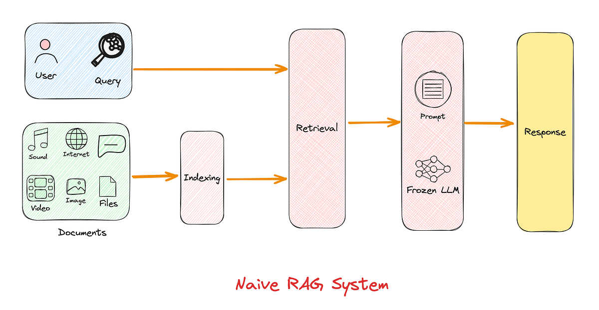

# Naive RAG Pipeline

### Overview
The simplest RAG pipeline involves three sequential steps:

   1. Indexing

       - Documents are split into chunks.

       - Each chunk is encoded into a vector using an embedding model.

       - These vectors are stored in a vector database.

   2. Retrieval

       - User query is also converted into a vector.

       - The top-K similar vectors (document chunks) are retrieved using similarity metrics.

   3. Generation

       - Retrieved content is concatenated with the query.

       - The combined input is passed into an LLM for generation.

---
### Limitations of Naive RAG:

   - May retrieve irrelevant content.

   - Doesn’t prioritize or summarize results.

   - Might cause hallucinations if bad content is retrieved.

   - Lacks control mechanisms and adaptability.
