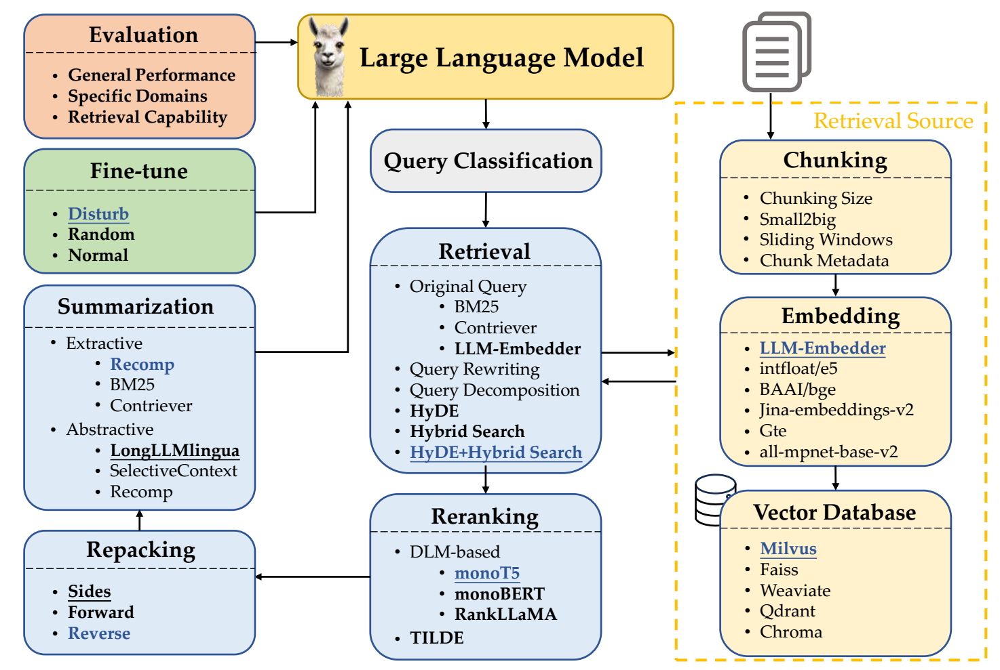

# Overview of Modules

A RAG system typically consists of several distinct processing modules. These modules represent different stages in the RAG pipeline and can be enhanced or replaced depending on the use case.

1. Query Classification

   - Purpose: To determine whether the input query needs retrieval or not.

   - Why it matters: Not all queries benefit from document retrieval. Simple factual or stylistic tasks may be better answered using the LLM alone.

   - Example: “Translate this sentence into French” doesn’t require external context.

   - Method: A classifier (like a BERT-based model) is used to predict if retrieval is needed.

2. Retrieval

   - Purpose: To fetch the most relevant document chunks from a corpus.

   - Steps:

       - Convert the user query to a vector.

       - Use a similarity function (dot product, cosine) to compare it with document vectors.

       - Return top-K matching chunks.

   - Types:

       - Original query retrieval.

       - Query rewriting to improve match quality.

       - Decomposed queries for complex inputs into series of simpler sub-questions.

       - HyDE (hypothetical document embeddings): uses an LLM to generate pseudo-docs(hypothetical answer) from the query. Then it embeds that answer and uses it to search the vector database.to enhance similarity matching.

3. Reranking

   - Purpose: To reorder the retrieved chunks based on relevance, trustworthiness, or task-specific criteria.

   - Methods:

       -  Use scoring models like monoT5, RankLLaMA.

       - Score the match between each retrieved chunk and the original query.

       - Select the best-ranked documents for input to the generator.

4. Repacking

   - Purpose: To arrange retrieved content in a coherent structure before feeding it to the generator.

   - Strategies:

       - Forward: Order documents as-is (descending relevancy score).

       - Reverse: Emphasize most recent or most relevant (ascending).

       - Sides: Group documents by topic or source.

5. Summarization

   - Purpose: To reduce the size of the retrieved content so it fits within the LLM's input limit.

   - Types:

       - Extractive: segment text into sentences, then score and rank them based on importance (e.g., using BM25).

       - Abstractive: Use another LLM to rephrase and generate a summary from multiple documents (e.g., LongLLMlingua, SelectiveContext).

       - Hybrid: Combine both approaches (e.g., Recomp).

6. Generation

   - Purpose: To synthesize an answer using the query and the processed retrieved content.

   - Input: The structured, possibly summarized, repacked content + original query.

   - Output: The final user-facing response.
